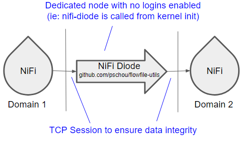

# FlowFile-Utils

A set of FlowFile routines for working with NiFi feeds.  The utilities include:

NiFi-Reciever - take a NiFi feed and save off files while doing checksums for validity

NiFi-Sender - take a file or directory and send them to a NiFi endpoint

NiFi-Stager - take a NiFi feed and temporarily store them to disk for processing later

NiFi-Unstager - take a directory of staged files and send them to a NiFi endpoint

NiFi-Diode - takes a NiFi feed and forwards the FlowFiles to another NiFi (assures one direction)

For more documentation about the go-flowfile library: https://pkg.go.dev/github.com/pschou/go-flowfile .

## NiFi Diode

Super simple NiFi Diode that does one thing, takes in data and passes it on to
another NiFi without letting anything go the other direction.  Hence it's a
simple, no-cache-diode.

The idea here is this server listens on a IP:Port and then any incomming
connection is streamed to another IP:Port, but data can only transfer one way.
The sending side will have no idea what server it is sending to nor be able to
get any information from the downstream NiFi.

Think of the NiFi diode like a one way glass.  The downstream NiFi sees
everything from the sending NiFi server as if the diode is not there but the
sending side only sees "NiFi Diode".  So if the downstream NiFi is expecting a
POST to go to an alternate content listener URL, the client must be configured
to point to the same URL as the diode will only reply with success if a success
happens.  No notifications are sent to the sending side what may have gone
wrong if a transfer fails.  This is to ensure nothing gets leaked back to the
sending side via server replies.

The only fields which are changed going through the diode in the forward
direction are the `Host` field (which NiFi needs to ensure connection
authenticity) and `X-Forwarded-For` which lists the remote endpoint(s).  If
multiple NiFi diode servers are stacked one upon another, the X-Forwarded-For
will have a complete list of source IP addresses seperated by commas.

### Why do I need this?

- Free and open-source (FOSS is good)
- Has a memory footprint of 1-50 MB. (It runs on cheap hardware)
- Can run directly from a kernel INIT= call - Avoid purchasing a dedicated
  hardware appliance.  Download your favorite distro and then modify the grub
  init to point to this binary instead of the standard init and you have yourself
  a linux based "hardware" NiFi diode.
- Standard data diode protections apply - place this on a box in a locked server
  room, and by denying physical access, you effectively prohibit data from going
  the wrong way. (It's a win-win!)
- Threadable, the server handles multiple concurrent flows which can help with
  latency issues and increase throughput.

What are the pitfalls?

- If the server dies, who knows for what reason, you need to get to the
  physical server to restore the diode.  A watchdog timer is included for this
  purpose, so set the timeout to an acceptable outage window size.  (overall this
  seems like a good risk when preventing reverse data flow)
- It's command line, so you have to know Linux. (my manager included this, but
  techies should know Linux)
- If you like burning all your data to a DVD and sneaker netting it between
  buildings, you'll have to find a gym now.  :(

# Usage Examples:
