# FlowFile-Utils

A set of FlowFile routines for working with FlowFile feeds.  The utilities include:

[FF-Sender](#ff-sender) - take a file or directory and send them to a FlowFile endpoint

[FF-HTTP-to-UDP](#ff-http-to-udp) - takes a FlowFile feed and sends it to a UDP endpoint

[FF-UDP-to-HTTP](#ff-udp-to-http) - listens for a UDP feed and sends it to a FlowFile endpoint

[FF-Sink](#ff-sink) - a listener that listens and accepts FlowFiles and does nothing

[FF-Flood](#ff-flood) - a sender which sends a continuous stream of FlowFiles

[FF-Receiver](#ff-receiver) - take a FlowFile feed and save off files while doing checksums for validity

[FF-Stager](#ff-stager) - take a FlowFile feed and temporarily store them to disk for processing later

[FF-Unstager](#ff-unstager) - listens to a directory of staged files and send them to a FlowFile endpoint

[FF-Diode](#ff-diode) - takes a FlowFile feed and forwards the FlowFiles to another listener (assures one direction)

[FF-HTTP-to-KCP](#ff-http-to-kcp) - takes a FlowFile feed and sends it to a KCP listener, enabling forward error correction (FEC)

[FF-KCP-to-HTTP](#ff-kcp-to-http) - listens for a KCP feed and sends it to a FlowFile endpoint, verifying and correcting errors


For more documentation about the go-flowfile library: https://pkg.go.dev/github.com/pschou/go-flowfile .


## FF Sender

FF sender does one thing, it will take data from the disk and upload it to a
HTTP/HTTPS endpoint.

- One does not need to install JAVA

- It is ultra portable and can run on a minimal instance

- Enables segmenting, so an upstream stream handler with limited capabilities can get segments instead of a whole file

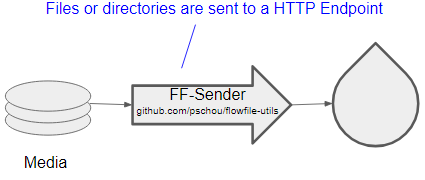

FF-Sender Usage:
```
FF-Sender (github.com/pschou/flowfile-utils, version: 0.1.20230221.0920)

This utility is intended to capture a set of files or directory of files and
send them to a remote FlowFile server for processing.

Usage: ../ff-sender [options] path1 path2...
  -CA string
    	A PEM encoded CA's certificate file. (default "someCertCAFile")
  -attributes string
    	File with additional attributes to add to FlowFiles
  -cert string
    	A PEM encoded certificate file. (default "someCertFile")
  -debug
    	Turn on debug in FlowFile library
  -key string
    	A PEM encoded private key file. (default "someKeyFile")
  -no-dedup
    	Deduplication by checksums (default true)
  -retries int
    	Retries after failing to send a file to a FlowFile listener (default 5)
  -retry-timeout duration
    	Time between retries (default 10s)
  -threads int
    	Number of concurrent sends (default 3)
  -update-chain
    	Update the connection chain attributes: "custodyChain.#.*"
    	To disable use -update-chain=false (default true)
  -url string
    	Where to send the files (default "http://localhost:8080/contentListener")
  -v	Turn on verbose (shorthand)
  -verbose
    	Turn on verbose
```

Example:
```
$ ./ff-sender -url http://localhost:8080/contentListener file1.dat file2.dat myDir/
2023/02/06 08:43:26 creating sender...
2023/02/06 08:43:26   sending file1.dat ...
2023/02/06 08:43:26   sending file2.dat ...
2023/02/06 08:43:26   sending empty dir myDir/ ...
2023/02/06 08:43:26 done.
```

## FF HTTP to UDP

FlowFile HTTP to UDP listens on a FlowFile endpoint and forwards all FlowFile connections to an
array of UDP ports.  This is intended to be a one way fire and forget setup
where the sender has no idea if the receiver got the packets, but the FlowFile
payload is broken up into indexed frames and sent so order can be restored on
the receiving side.

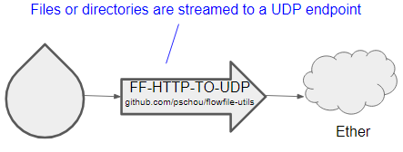

FF-HTTP-TO-UDP Usage:
```
FF-HTTP-TO-UDP (github.com/pschou/flowfile-utils, version: 0.1.20230221.0920)

This utility is intended to take input over a FlowFile compatible port and pass
all FlowFiles to a UDP endpoint after verifying checksums.  A chain of custody
is maintained by adding an action field with "HTTP-UDP" value.

Note: The port range used in the source UDP address directly affect the number
of concurrent sessions, and as payloads are buffered in memory (to do the
checksum) the memory bloat can be upwards on the order of NUM_PORTS *
MAX_PAYLOAD.  Please choose wisely.

The resend-delay will add latency (by delaying new connections until second
send is complete) but will add error resilience in the transfer.  In other
words, shortening the delay will likely mean more errors, while increaing will
slow down the number of accepted HTTP connections upstream.

Usage: ../ff-http-to-udp [options]
  -CA string
    	A PEM encoded CA's certificate file. (default "someCertCAFile")
  -attributes string
    	File with additional attributes to add to FlowFiles
  -cert string
    	A PEM encoded certificate file. (default "someCertFile")
  -debug
    	Turn on debug in FlowFile library
  -init-script string
    	Shell script to be called on start
    	Used to manually setup the networking interfaces when this program is called from GRUB
  -init-script-shell string
    	Shell to be used for init script run (default "/bin/bash")
  -key string
    	A PEM encoded private key file. (default "someKeyFile")
  -listen string
    	Where to listen to incoming connections (example 1.2.3.4:8080) (default ":8080")
  -listenPath string
    	Path in URL where to expect FlowFiles to be posted (default "/contentListener")
  -max-http-sessions int
    	Limit the number of allowed incoming HTTP connections (default 20)
  -mtu int
    	Maximum transmit unit (default 1200)
  -resend-delay duration
    	Time between first transmit and second, set to 0s to disable. (default 1s)
  -segment-max-size string
    	Set a maximum size for partitioning files in sending
  -throttle int
    	Bandwidth shape in bits per second (per thread), for example 80Mbps (default 83886080)
  -throttle-shared
    	By default each thread is throttled, instead throttle all threads as one (not recommended).
  -throttle-spec int
    	Frame spec defined by carrier/media, used to tune the tx rate.
    	This is the number of bytes added to the mtu which defines the time on the media between frames.
    	The value can be tuned (like -120 to 120). Frames are sent less frequently with a larger value.
  -tls
    	Enforce TLS secure transport on incoming connections
  -udp-dst-addr string
    	Target IP:PORT for sending UDP packet, to enable threading specify a port range
    	IE 10 threads split: 10.12.128.249:2100-2104,2106-2110, 1 thread: 10.12.128.249:2100 (default "10.12.128.249:2100-2107")
  -udp-src-addr string
    	Source IP:PORT for originating UDP packets, to enable threading specify a port range
    	IE 10 threads split: 10.12.128.249:3100-3104,3106-3110, 1 thread: 10.12.128.249:3100 (default "10.12.128.249:3100-3107")
  -update-chain
    	Update the connection chain attributes: "custodyChain.#.*"
    	To disable use -update-chain=false (default true)
  -v	Turn on verbose (shorthand)
  -verbose
    	Turn on verbose
  -watchdog duration
    	Trigger a reboot if no connection is seen within this time window
    	You'll need to make sure you have the watchdog module enabled on the host and kernel.
    	Default is disabled (-watchdog=0s)
```

Example:
```
$ ./ff-http-to-udp -listen :8082 -throttle 167us -throttle-gap 67ns -segment-max-size 10MB
2023/02/15 12:40:01 Creating senders for UDP from: 10.12.128.249:3100-3200
2023/02/15 12:40:01 Creating destinations for UDP: 10.12.128.249:2100-2200
2023/02/15 12:40:01 Creating listener on: :8082
2023/02/15 12:40:01 Setting max-size to 10.00MB
2023/02/15 12:40:01 Listening with HTTP on :8082 at /contentListener
```


## FF UDP to HTTP

FF UDP to HTTP listens on an array of UDP endpoint and forwards all FlowFiles to a
HTTP/HTTPS connection after doing consistency checks.  Here the heavy work is done to 
reconstruct a FlowFile and then do a checksum before forwarding onward.

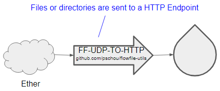

FF-UDP-TO-HTTP Usage:
```
FlowFile UDP -to-> HTTP (github.com/pschou/flowfile-utils, version: 0.1.20230221.0920)

This utility is intended to take input via UDP pass all FlowFiles to a UDP
endpoint after verifying checksums.  A chain of custody is maintained by adding
an action field with "UDP-TO-HTTP" value.

Usage: ../ff-udp-to-http [options]
  -CA string
    	A PEM encoded CA's certificate file. (default "someCertCAFile")
  -attributes string
    	File with additional attributes to add to FlowFiles
  -cert string
    	A PEM encoded certificate file. (default "someCertFile")
  -debug
    	Turn on debug in FlowFile library
  -init-script string
    	Shell script to be called on start
    	Used to manually setup the networking interfaces when this program is called from GRUB
  -init-script-shell string
    	Shell to be used for init script run (default "/bin/bash")
  -key string
    	A PEM encoded private key file. (default "someKeyFile")
  -mtu int
    	MTU payload size for pre-allocating memory (default 1500)
  -no-checksums
    	Ignore doing checksum checks
  -udp-dst-ip string
    	Local target IP:PORT for UDP packet (default ":2100-2200")
  -update-chain
    	Update the connection chain attributes: "custodyChain.#.*"
    	To disable use -update-chain=false (default true)
  -url string
    	Where to send the files (default "http://localhost:8080/contentListener")
  -v	Turn on verbose (shorthand)
  -verbose
    	Turn on verbose
  -watchdog duration
    	Trigger a reboot if no connection is seen within this time window
    	You'll need to make sure you have the watchdog module enabled on the host and kernel.
    	Default is disabled (-watchdog=0s)
```

Example:
```
$ ../ff-udp-to-http
2023/02/15 12:41:13 Creating FlowFile sender, http://localhost:8080/contentListener
2023/02/15 12:41:13 Listening on UDP :2100-2200
```

## FF Sink

FF-Sink listens on a FlowFile endpoint and accepts every file while doing nothing.

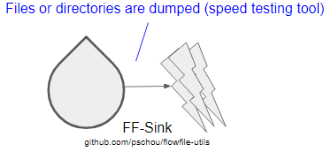

FF-Sink Usage:
```
FlowFile Sink (github.com/pschou/flowfile-utils, version: 0.1.20230221.0920)

This utility is intended to listen for FlowFiles on HTTP/HTTPS and drop them as
fast as they come in

Usage: ../ff-sink [options]
  -CA string
    	A PEM encoded CA's certificate file. (default "someCertCAFile")
  -cert string
    	A PEM encoded certificate file. (default "someCertFile")
  -debug
    	Turn on debug in FlowFile library
  -dump string
    	Dump the payload to the screen
  -init-script string
    	Shell script to be called on start
    	Used to manually setup the networking interfaces when this program is called from GRUB
  -init-script-shell string
    	Shell to be used for init script run (default "/bin/bash")
  -key string
    	A PEM encoded private key file. (default "someKeyFile")
  -listen string
    	Where to listen to incoming connections (example 1.2.3.4:8080) (default ":8080")
  -listenPath string
    	Path in URL where to expect FlowFiles to be posted (default "/contentListener")
  -segment-max-size string
    	Set a maximum size for partitioning files in sending
  -tls
    	Enforce TLS secure transport on incoming connections
  -update-chain
    	Update the connection chain attributes: "custodyChain.#.*"
    	To disable use -update-chain=false (default true)
  -v	Turn on verbose (shorthand)
  -verbose
    	Turn on verbose
  -watchdog duration
    	Trigger a reboot if no connection is seen within this time window
    	You'll need to make sure you have the watchdog module enabled on the host and kernel.
    	Default is disabled (-watchdog=0s)
```

Example:

```
$ ./ff-sink -v
2023/02/15 20:04:34 Listening with HTTP on :8080 at /contentListener
 - [{"Name":"path","Value":"./"},{"Name":"custodyChain.0.time","Value":"2023-02-15T20:04:37-05:00"},{"Name":"custodyChain.0.local.hostname","Value":"centos7.schou.me"},{"Name":"custodyChain.0.action","Value":"FLOOD"},{"Name":"filename","Value":"file0001.dat"},{"Name":"uuid","Value":"8a7ad2d7-9e6c-4b85-b2af-6a7b59dd8ed4"},{"Name":"checksumType","Value":"SHA1"},{"Name":"checksum","Value":"8bf6dc847a281d5042d681eb93b760f3d00c8df3"}]
2023/02/15 20:04:39     Checksum passed for file/segment file0000.dat 318.5MB
  - [{"Name":"path","Value":"./"},{"Name":"custodyChain.0.time","Value":"2023-02-15T20:04:37-05:00"},{"Name":"custodyChain.0.local.hostname","Value":"centos7.schou.me"},{"Name":"custodyChain.0.action","Value":"FLOOD"},{"Name":"filename","Value":"file0003.dat"},{"Name":"uuid","Value":"170c7599-dfe3-43ba-9499-ca97f3548dec"},{"Name":"checksumType","Value":"SHA1"},{"Name":"checksum","Value":"7a4e3a3ab5ef4656d391bcf54657b4e1436bd866"}]
  - [{"Name":"path","Value":"./"},{"Name":"custodyChain.0.time","Value":"2023-02-15T20:04:37-05:00"},{"Name":"custodyChain.0.local.hostname","Value":"centos7.schou.me"},{"Name":"custodyChain.0.action","Value":"FLOOD"},{"Name":"filename","Value":"file0002.dat"},{"Name":"uuid","Value":"f73084ea-97d8-4961-85d5-03a68de6382d"},{"Name":"checksumType","Value":"SHA1"},{"Name":"checksum","Value":"424e243fec99ce3d37086e76ae78c2b3dfe9a019"}]
2023/02/15 20:04:40     Checksum passed for file/segment file0001.dat 447.1MB
```

## FF Flood

FF Flood sends files (of various sizes) to a FlowFile endpoint to saturate the bandwidth.

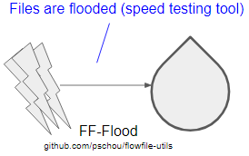

FF-Flood Usage:
```
FF-Flood (github.com/pschou/flowfile-utils, version: 0.1.20230221.0920)

This utility is intended to saturate the bandwidth of a FlowFile endpoint for
load testing.

Usage: ../ff-flood [options]
  -CA string
    	A PEM encoded CA's certificate file. (default "someCertCAFile")
  -attributes string
    	File with additional attributes to add to FlowFiles
  -cert string
    	A PEM encoded certificate file. (default "someCertFile")
  -debug
    	Turn on debug in FlowFile library
  -hash string
    	Hash to use in checksum value (default "SHA1")
  -key string
    	A PEM encoded private key file. (default "someKeyFile")
  -max string
    	Max payload size for upload in bytes (default "20MB")
  -min string
    	Min Payload size for upload in bytes (default "10MB")
  -name-format string
    	File naming format (default "file%04d.dat")
  -threads int
    	Parallel concurrent uploads (default 4)
  -update-chain
    	Update the connection chain attributes: "custodyChain.#.*"
    	To disable use -update-chain=false (default true)
  -url string
    	Where to send the files (default "http://localhost:8080/contentListener")
  -v	Turn on verbose (shorthand)
  -verbose
    	Turn on verbose
```

Example:
```
$ ../ff-flood  -max 1G
2023/02/15 20:04:37 Sending...
2023/02/15 20:04:38 3 sending file0000.dat 318.5MB
2023/02/15 20:04:38 1 sending file0001.dat 447.1MB
2023/02/15 20:04:40 2 sending file0003.dat 921.9MB
2023/02/15 20:04:40 0 sending file0002.dat 950MB
```

## FF Receiver

FF Receiver listens on a port for FlowFile FlowFiles and then acts on them accordingly as they are streamed in.

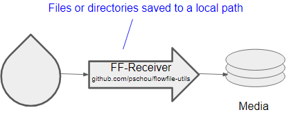

FF-Receiver Usage:
```
FlowFile Receiver (github.com/pschou/flowfile-utils, version: 0.1.20230221.0920)

This utility is intended to listen for FlowFiles via HTTP/HTTPS and then parse
these files and drop them to disk for usage elsewhere.

Usage: ../ff-receiver [options]
  -CA string
    	A PEM encoded CA's certificate file. (default "someCertCAFile")
  -cert string
    	A PEM encoded certificate file. (default "someCertFile")
  -debug
    	Turn on debug in FlowFile library
  -init-script string
    	Shell script to be called on start
    	Used to manually setup the networking interfaces when this program is called from GRUB
  -init-script-shell string
    	Shell to be used for init script run (default "/bin/bash")
  -key string
    	A PEM encoded private key file. (default "someKeyFile")
  -listen string
    	Where to listen to incoming connections (example 1.2.3.4:8080) (default ":8080")
  -listenPath string
    	Path in URL where to expect FlowFiles to be posted (default "/contentListener")
  -path string
    	Directory in which to place files received (default "./output/")
  -rm
    	Automatically remove file after script has finished
  -script string
    	Shell script to be called on successful post
  -script-shell string
    	Shell to be used for script run (default "/bin/bash")
  -segment-max-size string
    	Set a maximum size for partitioning files in sending
  -tls
    	Enforce TLS secure transport on incoming connections
  -update-chain
    	Update the connection chain attributes: "custodyChain.#.*"
    	To disable use -update-chain=false (default true)
  -v	Turn on verbose (shorthand)
  -verbose
    	Turn on verbose
  -watchdog duration
    	Trigger a reboot if no connection is seen within this time window
    	You'll need to make sure you have the watchdog module enabled on the host and kernel.
    	Default is disabled (-watchdog=0s)
```

Example:
```
$ ./ff-receiver
Output set to ./output/
2023/02/06 08:58:25 Listening with HTTP on :8080 at /contentListener
2023/02/06 08:58:28   Receiving file output/file1.dat size 18
2023/02/06 08:58:28   Verified file output/file1.dat
2023/02/06 08:58:28   Receiving file output/file2.dat size 10
2023/02/06 08:58:28   Verified file output/file2.dat
```

if one wants to act on the files after they arrive, they can add a script
caller which performs functions on the files just after a successful send:

```
$ cat script.sh
#!/bin/bash
echo In Script, doing something:
sha256sum "$1"
$ ./ff-receiver -script script.sh -verbose
Output set to ./output/
2023/02/06 08:59:38 Listening with HTTP on :8080 at /contentListener
2023/02/06 08:59:40   Receiving file output/file1.dat size 18
    [{"Name":"path","Value":"./"},{"Name":"filename","Value":"file1.dat"},{"Name":"modtime","Value":"2023-02-06T08:47:47-05:00"},{"Name":"checksum-type","Value":"SHA256"},{"Name":"checksum","Value":"51fd71b1368a1b130b60cab1301b05bbef470cf4a21ef2956553def809edf4ec"},{"Name":"uuid","Value":"271d19fd-827a-4c9d-a21e-7ede9d652120"}]
2023/02/06 08:59:40   Verified file output/file1.dat
2023/02/06 08:59:40   Calling script /bin/bash script.sh output/file1.dat
2023/02/06 08:59:40 ----- START script.sh output/file1.dat -----
In Script, doing something:
51fd71b1368a1b130b60cab1301b05bbef470cf4a21ef2956553def809edf4ec  output/file1.dat

2023/02/06 08:59:40 ----- END script.sh output/file1.dat -----
2023/02/06 08:59:40   Receiving file output/file2.dat size 10
    [{"Name":"path","Value":"./"},{"Name":"filename","Value":"file2.dat"},{"Name":"modtime","Value":"2023-02-06T08:47:53-05:00"},{"Name":"checksum-type","Value":"SHA256"},{"Name":"checksum","Value":"1e26ce5588db2ef5080a3df10385a731af2a4bfd0d2515f691d05d9dd900e18a"},{"Name":"uuid","Value":"08f48cce-b09f-47b7-9e5f-fbd0bf2e2b56"}]
2023/02/06 08:59:40   Verified file output/file2.dat
2023/02/06 08:59:40   Calling script /bin/bash script.sh output/file2.dat
2023/02/06 08:59:40 ----- START script.sh output/file2.dat -----
In Script, doing something:
1e26ce5588db2ef5080a3df10385a731af2a4bfd0d2515f691d05d9dd900e18a  output/file2.dat

2023/02/06 08:59:40 ----- END script.sh output/file2.dat -----
```

If one desires for the files to be removed after the script is ran:
```
$ ./ff-receiver -script script.sh -rm
Output set to ./output/
2023/02/06 09:06:18 Listening with HTTP on :8080 at /contentListener
2023/02/06 09:06:20   Receiving file output/file1.dat size 18
2023/02/06 09:06:20   Verified file output/file1.dat
2023/02/06 09:06:20   Calling script /bin/bash script.sh output/file1.dat
2023/02/06 09:06:20   Removed output/file1.dat
2023/02/06 09:06:20   Receiving file output/file2.dat size 10
2023/02/06 09:06:20   Verified file output/file2.dat
2023/02/06 09:06:20   Calling script /bin/bash script.sh output/file2.dat
2023/02/06 09:06:20   Removed output/file2.dat
^C
$ ls output/
$
```

## FF Stager

This tool enables files to be layed down to disk, to be replayed at a later time or different location into a FlowFile feed.  Note that the binary payload that is layed down is FlowFile encoded and not parsed out for making sure the exact binary payload is replayed.

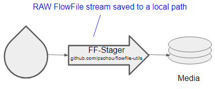

FF-Stager Usage:
```
FF-Stager (github.com/pschou/flowfile-utils, version: 0.1.20230221.0920)

This utility is intended to take input over a FlowFile compatible port and drop all
FlowFiles into directory along with associated attributes which can then be
unstaged using the FF-Unstager.

Usage: ../ff-stager [options]
  -CA string
    	A PEM encoded CA's certificate file. (default "someCertCAFile")
  -cert string
    	A PEM encoded certificate file. (default "someCertFile")
  -debug
    	Turn on debug in FlowFile library
  -init-script string
    	Shell script to be called on start
    	Used to manually setup the networking interfaces when this program is called from GRUB
  -init-script-shell string
    	Shell to be used for init script run (default "/bin/bash")
  -key string
    	A PEM encoded private key file. (default "someKeyFile")
  -listen string
    	Where to listen to incoming connections (example 1.2.3.4:8080) (default ":8080")
  -listenPath string
    	Path in URL where to expect FlowFiles to be posted (default "/contentListener")
  -path string
    	Directory in which stage FlowFiles (default "stager")
  -rm
    	Automatically remove file after script has finished
  -rm-partial
    	Automatically remove partial files
    	To unset this default use -rm-partial=false . (default true)
  -script string
    	Shell script to be called on successful post
  -script-shell string
    	Shell to be used for script run (default "/bin/bash")
  -segment-max-size string
    	Set a maximum size for partitioning files in sending
  -tls
    	Enforce TLS secure transport on incoming connections
  -update-chain
    	Update the connection chain attributes: "custodyChain.#.*"
    	To disable use -update-chain=false (default true)
  -v	Turn on verbose (shorthand)
  -verbose
    	Turn on verbose
  -watchdog duration
    	Trigger a reboot if no connection is seen within this time window
    	You'll need to make sure you have the watchdog module enabled on the host and kernel.
    	Default is disabled (-watchdog=0s)
```

Example:
```
$ ./ff-stager
Output set to stager
2023/02/06 12:01:10 Listening with HTTP on :8080 at /contentListener
  Receiving file file1.dat size 18
  Receiving file file2.dat size 10
```

The sending side sends like this:
```
$ ./ff-sender -url http://localhost:8080/contentListener file1.dat file2.dat
2023/02/06 12:03:06 creating sender...
2023/02/06 12:03:06   sending file1.dat ...
2023/02/06 12:03:06   sending file2.dat ...
2023/02/06 12:03:06 done.
```

Example with script triggered after a successful send:
```
$ cat stager_send.sh
#!/bin/bash
echo moving content "$1" to another folder /tmp
mv "$1" /tmp

$ ./ff-stager  -script stager_send.sh -verbose -rm
Output set to stager
2023/02/06 12:03:00 Listening with HTTP on :8080 at /contentListener
  Receiving file file1.dat size 18
    [{"Name":"path","Value":"./"},{"Name":"filename","Value":"file1.dat"},{"Name":"modtime","Value":"2023-02-06T08:47:47-05:00"},{"Name":"checksum-type","Value":"SHA256"},{"Name":"checksum","Value":"51fd71b1368a1b130b60cab1301b05bbef470cf4a21ef2956553def809edf4ec"},{"Name":"uuid","Value":"f0aa041f-3302-4358-acd1-136ba76078cf"}]
2023/02/06 12:03:06   Calling script /bin/bash stager_send.sh stager/60af9b0c-7f23-48a6-bc0e-4f44879e9f3a.dat stager/60af9b0c-7f23-48a6-bc0e-4f44879e9f3a.json
2023/02/06 12:03:06 ----- START stager_send.sh 60af9b0c-7f23-48a6-bc0e-4f44879e9f3a -----
moving content stager/60af9b0c-7f23-48a6-bc0e-4f44879e9f3a.dat to another folder /tmp

2023/02/06 12:03:06 ----- END stager_send.sh 60af9b0c-7f23-48a6-bc0e-4f44879e9f3a -----
2023/02/06 12:03:06   Removed 60af9b0c-7f23-48a6-bc0e-4f44879e9f3a
  Receiving file file2.dat size 10
    [{"Name":"path","Value":"./"},{"Name":"filename","Value":"file2.dat"},{"Name":"modtime","Value":"2023-02-06T08:47:53-05:00"},{"Name":"checksum-type","Value":"SHA256"},{"Name":"checksum","Value":"1e26ce5588db2ef5080a3df10385a731af2a4bfd0d2515f691d05d9dd900e18a"},{"Name":"uuid","Value":"794f5452-7aae-4748-8218-6892a9b0b4b5"}]
2023/02/06 12:03:06   Calling script /bin/bash stager_send.sh stager/02b1ee5d-432a-478d-920b-0e3052dc2344.dat stager/02b1ee5d-432a-478d-920b-0e3052dc2344.json
2023/02/06 12:03:06 ----- START stager_send.sh 02b1ee5d-432a-478d-920b-0e3052dc2344 -----
moving content stager/02b1ee5d-432a-478d-920b-0e3052dc2344.dat to another folder /tmp

2023/02/06 12:03:06 ----- END stager_send.sh 02b1ee5d-432a-478d-920b-0e3052dc2344 -----
2023/02/06 12:03:06   Removed 02b1ee5d-432a-478d-920b-0e3052dc2344
^C
```

Note the '-rm' makes sure any leftover artifacts are deleted (to prevent the
staging directory to be cluttered with leftover FlowFiles).

Using the '-rm-partial=false' will keep files from being deleted if they fail verifications.

## FF Unstager

The purpose of the ff-unstager is to replay the files layed to disk in the ff-stager operation.

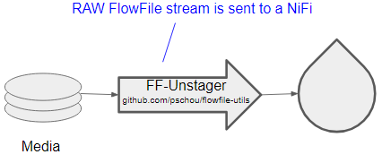

FF-Unstager Usage:
```
FF-Unstager (github.com/pschou/flowfile-utils, version: 0.1.20230221.0920)

This utility is intended to take a directory of FlowFiles and ship them out to
a listening HTTP/HTTPS endpoint while maintaining the same set of attribute
headers.

Usage: ../ff-unstager [options]
  -CA string
    	A PEM encoded CA's certificate file. (default "someCertCAFile")
  -attributes string
    	File with additional attributes to add to FlowFiles
  -cert string
    	A PEM encoded certificate file. (default "someCertFile")
  -debug
    	Turn on debug in FlowFile library
  -init-script string
    	Shell script to be called on start
    	Used to manually setup the networking interfaces when this program is called from GRUB
  -init-script-shell string
    	Shell to be used for init script run (default "/bin/bash")
  -key string
    	A PEM encoded private key file. (default "someKeyFile")
  -path string
    	Directory which to scan for FlowFiles (default "stager")
  -retries int
    	Retries after failing to send a file to a FlowFile listener (default 5)
  -retry-timeout duration
    	Time between retries (default 10s)
  -update-chain
    	Update the connection chain attributes: "custodyChain.#.*"
    	To disable use -update-chain=false (default true)
  -url string
    	Where to send the files (default "http://localhost:8080/contentListener")
  -v	Turn on verbose (shorthand)
  -verbose
    	Turn on verbose
  -watchdog duration
    	Trigger a reboot if no connection is seen within this time window
    	You'll need to make sure you have the watchdog module enabled on the host and kernel.
    	Default is disabled (-watchdog=0s)
```

Example:

The unstager listens to a directory and sends files to a remote url:
```
$ ./ff-unstager -url http://localhost:8080/contentListener -path stager
2023/02/06 12:22:10 Creating FlowFile sender to url http://localhost:8080/contentListener
2023/02/06 12:22:10 Creating directory listener on stager
  Unstaging file file2.dat
  Unstaging file file1.dat
```

The remote side sees the files come in as if they were just sent out from a FlowFile server.
```
$ ./ff-receiver
Output set to ./output/
2023/02/06 12:22:09 Listening with HTTP on :8080 at /contentListener
2023/02/06 12:22:10   Receiving file output/file2.dat size 10
2023/02/06 12:22:10   Verified file output/file2.dat
2023/02/06 12:22:10   Receiving file output/file1.dat size 18
2023/02/06 12:22:10   Verified file output/file1.dat
^C
```

## FF HTTP to KCP

FF HTTP to KCP tool will take a TCP FlowFile session, add forward error
correction, and stream it to a KCP listening server to reduce the latency over
long distances. As the sets of FlowFiles are handled as a continuous block,
and the entire block determines the success or failure-- one should send
batches of many FlowFiles instead of one at a time, but not too many, to not
have to restart if the connection gets lost.

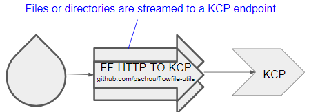

FF-HTTP-TO-KCP Usage:
```
FF-HTTP-TO-KCP (github.com/pschou/flowfile-utils, version: 0.1.20230221.0920)

This utility is intended to take input over a FlowFile compatible port and pass all
FlowFiles into KCP endpoint for speeding up throughput over long distances.

Usage: ../ff-http-to-kcp [options]
  -CA string
    	A PEM encoded CA's certificate file. (default "someCertCAFile")
  -cert string
    	A PEM encoded certificate file. (default "someCertFile")
  -crypto string
    	Enable or disable crypto
    	"none" To use no cipher. (default "salsa20:ThisIsASecret")
  -debug
    	Turn on debug in FlowFile library
  -dscp int
    	set DSCP(6bit) (default 46)
  -init-script string
    	Shell script to be called on start
    	Used to manually setup the networking interfaces when this program is called from GRUB
  -init-script-shell string
    	Shell to be used for init script run (default "/bin/bash")
  -kcp string
    	Target KCP server to send flowfiles (default "10.12.128.249:2112")
  -kcp-data int
    	Number of data packets to send in a FEC grouping (default 10)
  -kcp-parity int
    	Number of parity packets to send in a FEC grouping (default 3)
  -key string
    	A PEM encoded private key file. (default "someKeyFile")
  -listen string
    	Where to listen to incoming connections (example 1.2.3.4:8080) (default ":8080")
  -listenPath string
    	Path in URL where to expect FlowFiles to be posted (default "/contentListener")
  -mtu int
    	set maximum transmission unit for UDP packets (default 1350)
  -no-checksums
    	Ignore doing checksum checks
  -rcvwnd int
    	set receive window size(num of packets) (default 128)
  -readbuf int
    	per-socket read buffer in bytes (default 4194304)
  -segment-max-size string
    	Set a maximum size for partitioning files in sending
  -sndwnd int
    	set send window size(num of packets) (default 1024)
  -threads int
    	Parallel concurrent uploads (default 40)
  -tls
    	Enforce TLS secure transport on incoming connections
  -update-chain
    	Update the connection chain attributes: "custodyChain.#.*"
    	To disable use -update-chain=false (default true)
  -v	Turn on verbose (shorthand)
  -verbose
    	Turn on verbose
  -watchdog duration
    	Trigger a reboot if no connection is seen within this time window
    	You'll need to make sure you have the watchdog module enabled on the host and kernel.
    	Default is disabled (-watchdog=0s)
  -writebuf int
    	per-socket write buffer in bytes (default 16777217)
```

Example:

```
$ ./ff-http-to-kcp -listen :8082  -kcp-data 10 -kcp-parity 3 -v -segment-max-size 3MB
2023/02/15 22:23:19 Creating sender,
2023/02/15 22:23:19 Setting max-size to 3.00MB
2023/02/15 22:23:19 Listening with HTTP on :8082 at /contentListener
```

## FF KCP to HTTP

KCP FlowFile server listening for connections from the FF-HTTP-TO-KCP and then
forwarding the FlowFiles to a FlowFile compatible port while correcting errors in
transmission.

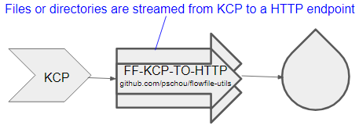

FF-KCP-TO-HTTP Usage:
```
FF-KCP-TO-HTTP (github.com/pschou/flowfile-utils, version: 0.1.20230221.0920)

This utility is intended to take input over a KCP connection and send FlowFiles
into a HTTP/HTTPS compatible port for speeding up throughput over long distances.

Usage: ../ff-kcp-to-http [options]
  -CA string
    	A PEM encoded CA's certificate file. (default "someCertCAFile")
  -attributes string
    	File with additional attributes to add to FlowFiles
  -cert string
    	A PEM encoded certificate file. (default "someCertFile")
  -crypto string
    	Enable or disable crypto
    	"none" To use no cipher. (default "salsa20:ThisIsASecret")
  -debug
    	Turn on debug in FlowFile library
  -init-script string
    	Shell script to be called on start
    	Used to manually setup the networking interfaces when this program is called from GRUB
  -init-script-shell string
    	Shell to be used for init script run (default "/bin/bash")
  -kcp string
    	Listen port for KCP connections (default ":2112")
  -kcp-data int
    	Number of data packets to send in a FEC grouping (default 10)
  -kcp-parity int
    	Number of parity packets to send in a FEC grouping (default 3)
  -key string
    	A PEM encoded private key file. (default "someKeyFile")
  -mtu int
    	set maximum transmission unit for UDP packets (default 1350)
  -no-checksums
    	Ignore doing checksum checks
  -rcvwnd int
    	set receive window size(num of packets) (default 1024)
  -sndwnd int
    	set send window size(num of packets) (default 128)
  -update-chain
    	Update the connection chain attributes: "custodyChain.#.*"
    	To disable use -update-chain=false (default true)
  -url string
    	Where to send the files (default "http://localhost:8080/contentListener")
  -v	Turn on verbose (shorthand)
  -verbose
    	Turn on verbose
  -watchdog duration
    	Trigger a reboot if no connection is seen within this time window
    	You'll need to make sure you have the watchdog module enabled on the host and kernel.
    	Default is disabled (-watchdog=0s)
```

Example:

```
$ ./ff-kcp-to-http -v -kcp-data 10 -kcp-parity 3
2023/02/15 22:26:18 Creating sender, http://localhost:8080/contentListener
```

## FF Diode

A simple FlowFile Diode that does one thing, takes in data and passes it on to
another FlowFile without letting anything go the other direction.  Hence it is a
simple, no-cache-diode.

The idea here is this server listens on a IP:Port and then any incomming
connection is streamed to another IP:Port, but data can only transfer one way.
The sending side will have no idea what server it is sending to nor be able to
get any information from the downstream listener.

Think of the FlowFile diode like a one way glass.  The downstream FlowFile sees
everything from the sending FlowFile server as if the diode is not there but the
sending side only sees "FF Diode".  So if the downstream FlowFile is expecting a
POST to go to an alternate content listener URL, the client must be configured
to point to the same URL as the diode will only reply with success if a success
happens.  No notifications are sent to the sending side what may have gone
wrong if a transfer fails.  This is to ensure nothing gets leaked back to the
sending side via server replies.

The only fields which are changed going through the diode in the forward
direction are the `Host` field (which FlowFile needs to ensure connection
authenticity) and `X-Forwarded-For` which lists the remote endpoint(s).  If
multiple FlowFile diode servers are stacked one upon another, the X-Forwarded-For
will have a complete list of source IP addresses seperated by commas.


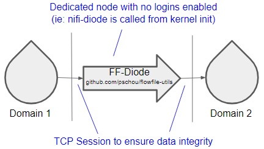

### Why do I need this?

- Free and open-source (FOSS is good)
- Has a memory footprint of 1-50 MB. (It runs on cheap hardware)
- Can run directly from a kernel INIT= call - Avoid purchasing a dedicated
  hardware appliance.  Download your favorite distro and then modify the grub
  init to point to this binary instead of the standard init and you have yourself
  a linux based "hardware" FlowFile diode.
- Standard data diode protections apply - place this on a box in a locked server
  room, and by denying physical access, you effectively prohibit data from going
  the wrong way. (It's a win-win!)
- Threadable, the server handles multiple concurrent flows which can help with
  latency issues and increase throughput.

What are the pitfalls?

- If the server dies, who knows for what reason, you need to get to the
  physical server to restore the diode.  A watchdog timer is included for this
  purpose, so set the timeout to an acceptable outage window size.  (overall this
  seems like a good risk when preventing reverse data flow)
- It's command line, so you have to know Linux. (my manager included this, but
  techies should know Linux)
- If you like burning all your data to a DVD and sneaker netting it between
  buildings, you'll have to find a gym now.  :(

FF-Diode Usage:
```
FF-Diode (github.com/pschou/flowfile-utils, version: 0.1.20230221.0920)

This utility is intended to take input over a FlowFile compatible port and pass all
FlowFiles into another HTTP/HTTPS port while updating the attributes with the
certificate and chaining any previous certificates.

Usage: ../ff-diode [options]
  -CA string
    	A PEM encoded CA's certificate file. (default "someCertCAFile")
  -attributes string
    	File with additional attributes to add to FlowFiles
  -cert string
    	A PEM encoded certificate file. (default "someCertFile")
  -debug
    	Turn on debug in FlowFile library
  -init-script string
    	Shell script to be called on start
    	Used to manually setup the networking interfaces when this program is called from GRUB
  -init-script-shell string
    	Shell to be used for init script run (default "/bin/bash")
  -key string
    	A PEM encoded private key file. (default "someKeyFile")
  -listen string
    	Where to listen to incoming connections (example 1.2.3.4:8080) (default ":8080")
  -listenPath string
    	Path in URL where to expect FlowFiles to be posted (default "/contentListener")
  -metrics-ff
    	Send local metrics as a FlowFile (default true)
  -no-checksums
    	Ignore doing checksum checks
  -segment-max-size string
    	Set a maximum size for partitioning files in sending
  -tls
    	Enforce TLS secure transport on incoming connections
  -update-chain
    	Update the connection chain attributes: "custodyChain.#.*"
    	To disable use -update-chain=false (default true)
  -url string
    	Where to send the files (default "http://localhost:8080/contentListener")
  -v	Turn on verbose (shorthand)
  -verbose
    	Turn on verbose
  -watchdog duration
    	Trigger a reboot if no connection is seen within this time window
    	You'll need to make sure you have the watchdog module enabled on the host and kernel.
    	Default is disabled (-watchdog=0s)
```

# Example:

Here are some examples of the ff-sender and ff-receiver in action.  To set things up, we need some fake data first:

```
source$ dd if=/dev/urandom of=infile_rnd.dat count=100000
```

## Sender and receiver

Setting up the FlowFile receiver first:
```
target$ ./ff-receiver
Output set to ./output/
2023/02/06 20:20:03 Listening with HTTP on :8080 at /contentListener
```

We can now send a file:
```
source$ ./ff-sender -url=http://localhost:8080/contentListener output2/
2023/02/06 20:20:16 creating sender...
2023/02/06 20:20:16   sending empty dir output2/a ...
2023/02/06 20:20:16   sending empty dir output2/b ...
2023/02/06 20:20:16   sending output2/infile.dat ...
2023/02/06 20:20:16   sending output2/infile_rnd.dat ...
2023/02/06 20:20:17   sending output2/output/infile_rnd.dat ...
2023/02/06 20:20:18   sending output2/random ...
2023/02/06 20:20:22 done.
```

Back at the FlowFile receiver side:
```
target$ ./ff-receiver
Output set to ./output/
2023/02/06 20:20:03 Listening with HTTP on :8080 at /contentListener
2023/02/06 20:20:16   Receiving flowfile output/output2/infile.dat size 512000
2023/02/06 20:20:16   Verified file output/output2/infile.dat
2023/02/06 20:20:16   Receiving flowfile output/output2/infile_rnd.dat size 51200000
2023/02/06 20:20:17   Verified file output/output2/infile_rnd.dat
2023/02/06 20:20:18   Receiving flowfile output/output2/output/infile_rnd.dat size 51200000
2023/02/06 20:20:18   Verified file output/output2/output/infile_rnd.dat
2023/02/06 20:20:20   Receiving flowfile output/output2/random size 153600000
2023/02/06 20:20:22   Verified file output/output2/random
```

The files have been sent and dropped to the folder output

## Sender, diode, and receiver

Here we will look at tying 3 of these utilities together, in this order we setup the FlowFile receiver first:
```
target$ ./ff-receiver -path output2
2023/02/02 14:57:33 Listening with HTTP on :8080 at /contentListener
```

Setup the diode to make the connections in-between:
```
diode$ ./ff-diode -segment-max-size 10MB -url=http://localhost:8080/contentListener -listen :8082
2023/02/02 14:58:28 creating sender...
2023/02/02 14:58:28 Listening with HTTP on :8082 at /contentListener
```

and finally we send a file:
```
source$ ./ff-sender -url=http://localhost:8082/contentListener infile_rnd.dat
2023/02/02 14:59:04 creating sender...
2023/02/02 14:59:04   sending infile_rnd.dat ...
```

back at the target, we can verify that the file has shown up:
```
target$ ls output2/
infile_rnd.dat
```

## Restrict size throughput

```bash
$ ./ff-diode -segment-max-size 10MB -url https://localhost:8080/contentListener -listen :8082 -tls
```

## Add Additional Custom Attributes

```bash
$ cat example_attributes.yml
# Some attributes example, this is one-per-line and "key: value" format
MY_poc:     dan
MY_sidecar: 123
MY_group:   TeamA

$ ./ff-diode -segment-max-size 10MB -CA test/ca_cert_DONOTUSE.pem -key test/npe2_key_DONOTUSE.pem -cert test/npe2_cert_DONOTUSE.pem  -url https://localhost:8080/contentListener -listen :8082 -tls -attributes example_attributes.yml
```

## Chain of Custody

When using these flowfile-util tools, the attributes are updated to include
chain of custody details,  Here is an example of one such set of metadata from
a flow that went through a KCP connection, a diode, and then put to disk.  Note
the timestamps in RFC3339 with nano seconds enables high precision tracking of
FlowFile latencies.

```json
{
  "path": "output2/",
  "filename": "random",
  "file.lastModifiedTime": "2023-02-05T19:46:38-05:00",
  "file.creationTime": "2023-02-05T19:46:38-05:00",
  "file.permissions": "rw-rw-r--",
  "custodyChain.3.time": "2023-02-21T09:27:27.834231264-05:00",
  "custodyChain.3.local.hostname": "centos7.schou.me",
  "custodyChain.3.action": "SENDER",
  "fragment.identifier": "cff5e3e4-f11c-43d1-8242-0d4c50039097",
  "segment.original.size": "153600000",
  "segment.original.filename": "random",
  "segment.original.checksumType": "SHA256",
  "segment.original.checksum": "396abebff84e327ec40ca695e46d536467f746f6d2f129308702781cb64df95d",
  "merge.reason": "MAX_BYTES_THRESHOLD_REACHED",
  "fragment.offset": "115343360",
  "fragment.index": "12",
  "fragment.count": "15",
  "uuid": "b541fed3-5507-4f34-b1e6-c33eadb04eea",
  "checksumType": "SHA256",
  "checksum": "87fef5d2a7956b105248e1137a533cd7d79e1bd04451ac1f5826263997f95ba5",
  "custodyChain.2.time": "2023-02-21T09:27:40.677422781-05:00",
  "custodyChain.2.local.hostname": "centos7.schou.me",
  "custodyChain.2.action": "HTTP-UDP",
  "custodyChain.2.request.uri": "/contentListener",
  "custodyChain.2.source.host": "::1",
  "custodyChain.2.protocol": "HTTP",
  "custodyChain.2.local.port": "8080",
  "custodyChain.1.time": "2023-02-21T09:27:42.781802683-05:00",
  "custodyChain.1.local.hostname": "centos7.schou.me",
  "custodyChain.1.action": "UDP-TO-HTTP",
  "custodyChain.0.time": "2023-02-21T09:27:42.783044223-05:00",
  "custodyChain.0.local.hostname": "centos7.schou.me",
  "custodyChain.0.action": "DIODE",
  "custodyChain.0.request.uri": "/contentListener",
  "custodyChain.0.source.host": "::1",
  "custodyChain.0.protocol": "HTTP",
  "custodyChain.0.local.port": "8082"
}
```
